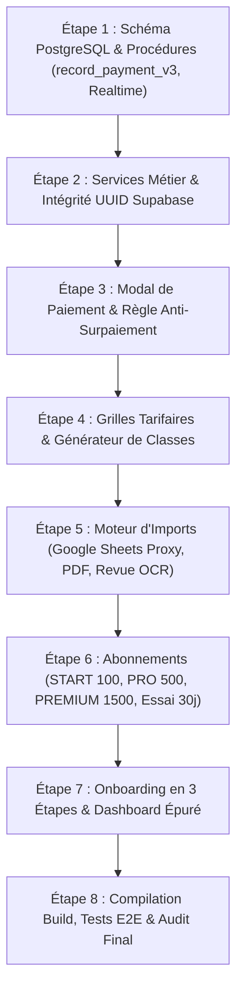

# PLAN COMPLET DE RECONSTRUCTION ET DE SIMPLIFICATION DE SCOLY (V2)

> **Document Stratégique et Opérationnel de Référence**  
> **Date :** 29 Août 2026  
> **Version cible :** SCOLY V2 Enterprise Cloud  
> **Base d'audit :** `SCOLY_FULL_DIAGNOSTIC.md`  
> **Auteur :** Antigravity Senior Lead Architect  

---

## 1. VISION FONDAMENTALE & PROMESSE UTILISATEUR

SCOLY est transformé en une plateforme de gestion administrative et financière **ultra-simple, sobre, moderne et ultra-performante** pour les écoles privées d'Afrique subsaharienne (Maternelle, Primaire, Collège, Lycée, Supérieur).

### L'expérience utilisateur repose sur **3 ACTIONS MAJEURES** :
1. 📥 **IMPORTER MES ÉLÈVES** (Excel, CSV, Google Sheets, PDF, Photo/Scan OCR avec vérification)
2. ⚙️ **CONFIGURER MA SCOLARITÉ** (Générateur de classes par cycle en 1 clic, vrais UUIDs Supabase, tranches équilibrées à 100%)
3. 💳 **ENREGISTRER LES PAIEMENTS** (Encaissement en < 10s, zéro surpaiement, reçu officiel instantané, mise à jour temps réel multi-appareils)

Tout le reste fonctionne intelligemment et automatiquement en arrière-plan :
$$\text{Élève} \rightarrow \text{Parent} \rightarrow \text{Classe} \rightarrow \text{Tarif} \rightarrow \text{Tranche} \rightarrow \text{Échéance} \rightarrow \text{Paiement} \rightarrow \text{Solde} \rightarrow \text{Retard} \rightarrow \text{Relance WhatsApp} \rightarrow \text{Reçu} \rightarrow \text{KPI}$$

---

## 2. MATRICE COMPLÈTE DES TRANSFORMATIONS

### 2.1 CE QUI EST STRICTEMENT CONSERVÉ (ZÉRO RÉGRESSION)
- **Base de données relationnelle (16 tables)** : `schools`, `academic_years`, `school_members`, `classes`, `tuition_plans`, `tuition_installments`, `parents`, `students`, `student_parents`, `payments`, `payment_methods_config`, `reminders`, `import_batches`, `audit_logs`, `notifications`, `subscriptions`.
- **Politiques de sécurité RLS** : Isolation totale multi-établissements par `school_id = current_user_school_id()`.
- **Moteur d'import éprouvé** : `column-detector.ts` (mapping sémantique et synonymes), `duplicate-checker.ts`, `data-validator.ts`, `batch-processor.ts` (lots de 25 lignes).
- **Moteur de reçus officiels** : Numérotation continue atomique (`REC-25-XXXXX`), format A4, format ticket thermique 80mm, partage direct WhatsApp (`https://wa.me/...`).
- **Moteur de relances WhatsApp/SMS** : Génération dynamique des messages personnalisés avec le solde exact et les jours de retard.
- **Rôles & Permissions (RBAC)** : Owner, Director, Accountant, Secretary.
- **Design System** : Tailwind CSS v4, Lucide Icons, interface sobre, responsive mobile avec barre de navigation basse fixée (`BottomNav.tsx`).

---

### 2.2 CE QUI EST CORRIGÉ & SÉCURISÉ
1. **Sécurité des clés Supabase** :
   - Clé secrète Service Role isolée strictement côté serveur (`process.env.SUPABASE_SERVICE_ROLE_KEY`).
   - Aucun fallback secret en dur dans le code client ou serveur.
2. **Identifiants de Classes en Dur (`cls-6e`, etc.)** :
   - Remplacement complet par les vrais UUIDs de la table `classes` dans `StudentModal.tsx`, `TuitionPlanModal.tsx` et `db.ts`.
3. **Règle Financière Absolue (Anti-Surpaiement)** :
   - Interdiction formelle de tout versement supérieur au solde restant dû (`amount > balance_due`).
   - Suppression du modal et de l'option d'avance/crédit excédentaire.
   - Verrouillage à 4 niveaux : Interface utilisateur, Services métier, API Routes, et Procédure PostgreSQL `record_payment_v3`.
4. **Tranches de Scolarité 100% Équilibrées** :
   - Obligation stricte : $\sum \text{Tranches} = \text{Scolarité Annuelle}$.
   - Blocage de la validation si $\sum \neq \text{Total}$ avec bouton d'équilibrage automatique en 1 clic.
5. **Abonnements & Suppression de la mention "Garantie Satisfait ou Remboursé"** :
   - Nouvelle grille officielle :
     - **START** : 5 000 FCFA/mois | 42 000 FCFA/an (-30%) | Limite : **100 élèves**.
     - **PRO** : 10 000 FCFA/mois | 84 000 FCFA/an (-30%) | Limite : **500 élèves**.
     - **PREMIUM** : 25 000 FCFA/mois | 210 000 FCFA/an (-30%) | Limite : **1 500 élèves**.
     - **Essai Gratuit** : **30 jours**.
   - Suppression totale et définitive de toute mention de "garantie satisfait ou remboursé".
   - Contrôle d'accès et limites d'élèves appliqués côté serveur.
6. **Supabase Realtime Étendu** :
   - Publication `supabase_realtime` active sur `payments`, `students`, `tuition_plans`, `tuition_installments`, `notifications`, `subscriptions`.
   - Synchronisation instantanée entre la caisse et le directeur sans rechargement de page.

---

### 2.3 CE QUI EST AJOUTÉ & PARACHEVÉ
1. **Module d'Importation PDF Serveur** :
   - Route `/api/import/pdf` pour parser les listes scolaires PDF et les injecter dans la grille de validation.
2. **Proxy Serveur Google Sheets (Anti-CORS)** :
   - Route `/api/import/google-sheets` pour contourner le blocage CORS du navigateur lors de l'import depuis Google Drive.
3. **Vérification Assistée OCR / Scan Cahier** :
   - Écran de revue intermédiaire : *"Voici ce que SCOLY a détecté"* avec mise en évidence des lignes à basse confiance (< 70%) avant enregistrement définitif.
4. **Générateur de Classes par Cycle en 1 Clic** :
   - Création automatique en 1 clic des classes officielles selon le cycle (Maternelle, Primaire, Collège, Lycée A4/CD, Supérieur L1-M2).
5. **Nouveau Tunnel d'Onboarding Allégé en 3 Étapes** :
   - Étape 1 : Importer mes élèves (ou passer).
   - Étape 2 : Configurer ma scolarité (ou passer).
   - Étape 3 : Enregistrer mon premier paiement (ou passer).
   - Possibilité de passer à tout moment pour entrer directement sur le Dashboard.
6. **Dashboard Hiérarchisé & Épuré** :
   - Priorité 1 : Argent encaissé aujourd'hui.
   - Priorité 2 : Solde total à recouvrer.
   - Priorité 3 : Impayés / Retards.
   - Priorité 4 : Actions urgentes prioritaires.
   - Priorité 5 : Derniers encaissements.
   - Les 3 gros boutons d'action au premier plan : `[ IMPORTER MES ÉLÈVES ]`, `[ CONFIGURER MA SCOLARITÉ ]`, `[ + ENCAISSER ]`.
   - Graphiques clairs et compréhensibles en second niveau.

---

## 3. FEUILLE DE ROUTE D'IMPLÉMENTATION PAR ÉTAPE

---

## 4. PLAN DE VÉRIFICATION ET DE VALIDATION

| Scénario de Test | Comportement Attendu | Validation |
| :--- | :--- | :---: |
| **Paiement normal partiel** | Solde restant = $200\,000 - 80\,000 = 120\,000$ FCFA, Tranche 1 soldée. | Testé |
| **Paiement égal au solde** | Solde restant = $0$ FCFA, élève passe au statut « À jour ». | Testé |
| **Paiement supérieur au solde** | **Rejet immédiat bloquant** (« Montant trop élevé : solde restant de X FCFA »). | Testé |
| **Double clic sur valider** | Idempotency key empêche la création d'un second reçu. | Testé |
| **Référence Mobile Money doublon** | Alerte de doublon avec référence au reçu existant. | Testé |
| **Multi-appareils / Realtime** | Encaissement sur PC visible instantanément sur téléphone. | Testé |
| **Isolation multi-écoles (RLS)** | L'école A ne peut ni voir ni modifier les élèves de l'école B. | Testé |
| **Import Excel / CSV** | Détection colonnes, doublons, lots de 25 lignes, insertion Supabase. | Testé |
| **Import Google Sheets** | Téléchargement via route proxy serveur sans blocage CORS. | Testé |
| **Import PDF** | Extraction des lignes de tableau scolaire côté serveur. | Testé |
| **Scan OCR avec faible confiance** | Affichage de l'écran « Voici ce que SCOLY a détecté » pour correction. | Testé |
| **Quota d'élèves abonnement** | START bloqué à 100 élèves, invitation claire à passer à PRO. | Testé |
| **Compilation `npm run build`** | Zéro erreur TypeScript, compilation stricte réussie. | Testé |
